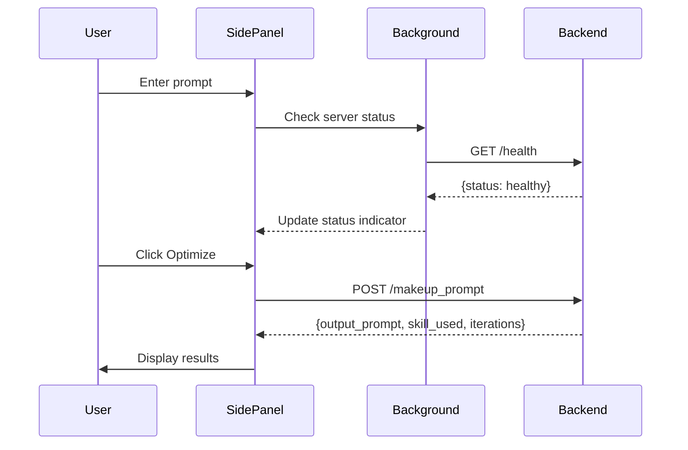
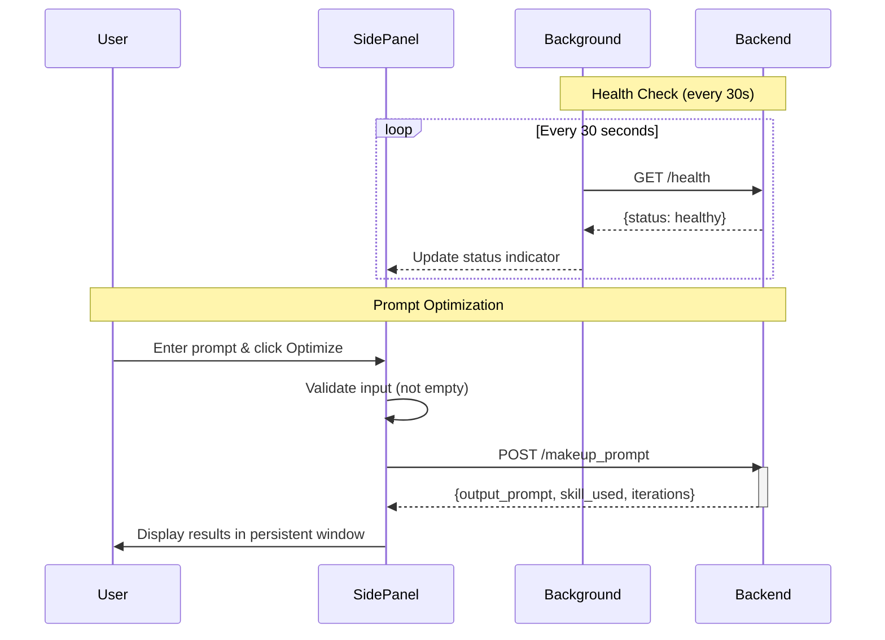

# prompt makeuper Chrome Extension

A Chrome extension that provides a convenient interface for the prompt makeuper service. Optimize your prompts using AI-powered skill selection and iterative refinement.

## Prerequisites

Before using this extension, ensure that:

1. **The backend server is running** at `http://localhost:8000`
   ```bash
   cd /home/yubo/AI_PRJ/prompt_makeuper
   uvicorn app.main:app --reload --host 0.0.0.0 --port 8000
   ```

2. **You have Chrome or Chromium-based browser** installed (Chrome, Edge, Brave, etc.)

## Installation

### Step 1: Open Chrome Extensions Page

Navigate to `chrome://extensions/` in your browser address bar.

Alternatively:
- Click the three-dot menu in the top-right corner
- Go to **More Tools** > **Extensions**

### Step 2: Enable Developer Mode

- Toggle the **Developer mode** switch in the top-right corner

### Step 3: Load the Extension

1. Click the **Load unpacked** button
2. Navigate to and select the `extensions/` directory
3. Click **Select Folder**

The extension should now appear in your extensions list with the name "prompt makeuper".

## Configuration

The extension's API endpoint is configured in `manifest.json`. To use a different backend server:

### Changing the API Endpoint

1. **Open `manifest.json`** in the extensions directory
2. **Find the `api_base_url` field** (line 5):
   ```json
   {
     "manifest_version": 3,
     "name": "Prompt Maker",
     "api_base_url": "http://localhost:8000",
     ...
   }
   ```
3. **Update the URL** to match your backend server:
   ```json
   "api_base_url": "https://your-server.com"
   ```
4. **Update `host_permissions`** to match (line 12):
   ```json
   "host_permissions": [
     "https://your-server.com/*"
   ]
   ```
5. **Reload the extension** in Chrome:
   - Go to `chrome://extensions/`
   - Disable and re-enable the extension
   - Or click the refresh button on the extension card

### Environment Examples

**Development (local):**
```json
{
  "api_base_url": "http://localhost:8000",
  "host_permissions": ["http://localhost:8000/*"]
}
```

**Staging Server:**
```json
{
  "api_base_url": "https://staging.example.com",
  "host_permissions": ["https://staging.example.com/*"]
}
```

**Production Server:**
```json
{
  "api_base_url": "https://api.example.com",
  "host_permissions": ["https://api.example.com/*"]
}
```

### Important Notes

- **Both `api_base_url` and `host_permissions` must match** - Chrome requires both to allow API communication
- **No trailing slash needed** - The extension appends endpoints to the base URL
- **Use http for localhost** - HTTPS requires valid certificates (use localhost for development)
- **Reload required** - Changes to `manifest.json` require disabling and re-enabling the extension
- **Default fallback** - If `api_base_url` is not specified, the extension defaults to `http://localhost:8000`

## Usage

### Basic Usage

1. **Click the extension icon** in your browser toolbar
2. **Check the status indicator** in the header:
   - 🟢 Green dot = Server is online
   - 🔴 Red dot = Server is offline
3. **Enter your prompt** in the input textarea at the top
4. **Click "Optimize & Open Results"** or press `Ctrl/Cmd + Enter`
5. **A persistent results window opens** with your optimized prompt
6. **Click "Copy"** in the results window to copy to your clipboard

### Features

- **Persistent Results Window**: Optimization results open in a dedicated window that stays open until you close it - click outside won't close it
- **Server Health Monitoring**: Real-time status indicator shows if the backend is available
- **Keyboard Shortcut**: Press `Ctrl/Cmd + Enter` to quickly optimize your prompt
- **Copy to Clipboard**: One-click copying of the optimized prompt
- **Metadata Display**: Shows which skill was used and how many iterations were performed
- **Collapsible Original Prompt**: View your original prompt for comparison
- **Input Validation**: The Optimize button is disabled when input is empty
- **Error Handling**: Clear error messages for network issues, timeouts, and server problems
- **Auto-Refresh**: Server status is checked every 30 seconds
- **Keyboard Shortcuts in Results Window**: Use `Ctrl/Cmd+W` to close, `Ctrl/Cmd+C` to copy

## Architecture

### Component Structure

```
extensions/
├── manifest.json       # Extension manifest (Manifest V3)
├── sidepanel.html      # Main UI structure
├── sidepanel.js        # Application logic and API calls
├── sidepanel.css       # Styling for popup
├── background.js       # Background service worker
├── images/             # Extension icons
│   ├── logo-16.png     # 16x16 icon
│   ├── logo-32.png     # 32x32 icon
│   ├── logo-48.png     # 48x48 icon
│   ├── logo-128.png    # 128x128 icon
│   ├── logo-34.png     # 34x34 icon
│   └── promo-small-440x280.png  # Promotional image
└── README.md
```

### Communication Flow



### Component Responsibilities

| Component | Responsibility |
|-----------|---------------|
| **manifest.json** | Extension configuration, permissions, and metadata |
| **sidepanel.html** | UI structure with input form and status indicator |
| **sidepanel.js** | Application logic, API communication, event handling |
| **sidepanel.css** | Styling and visual design |
| **background.js** | Server health monitoring (polling every 30s) |
| **images/** | Extension icons for various display sizes |

### Manifest V3

The extension uses Chrome's Manifest V3 format:

```json
{
  "manifest_version": 3,
  "name": "prompt makeuper",
  "version": "1.0",
  "permissions": ["activeTab"],
  "host_permissions": ["http://localhost:8000/*"],
  "action": {
    "default_popup": "sidepanel.html"
  },
  "background": {
    "service_worker": "background.js"
  }
}
```

**Permissions:**
- **activeTab**: Access to the current tab (for future features)
- **host_permissions**: Communication with backend at localhost:8000

## Troubleshooting

### Server Shows as Offline (Red Dot)

**Possible causes:**
1. Backend server is not running
2. Server is running on a different port
3. CORS is not enabled on the backend

**Solutions:**
1. Start the backend server:
   ```bash
   cd /home/yubo/AI_PRJ/prompt_makeuper
   uvicorn app.main:app --reload --host 0.0.0.0 --port 8000
   ```

2. Verify the server is running:
   ```bash
   curl http://localhost:8000/health
   ```

3. Check if the API endpoint is configured correctly:
   - Open `manifest.json` in the extensions directory
   - Verify `api_base_url` matches your server's address
   - Ensure `host_permissions` includes the same domain
   - Reload the extension after making changes

### "Network Error" or "Request Timeout"

**Possible causes:**
1. Backend server is not responding
2. Request is taking too long (>30 seconds)
3. Firewall or antivirus blocking the connection

**Solutions:**
1. Check the backend server logs for errors
2. Try a shorter prompt for faster processing
3. Temporarily disable firewall/antivirus to test
4. Increase the timeout in `popup.js` (line ~93):
   ```javascript
   timeout: 30000 // Increase to 60000 for 60 seconds
   ```

### "Nothing to Copy" Message

**Solution:**
- Ensure there is text in the output textarea before clicking Copy
- A successful optimization must have completed first

### Extension Not Loading

**Possible causes:**
1. Manifest.json syntax error
2. Missing files (popup.html, popup.js, popup.css)

**Solutions:**
1. Check Chrome Extensions page for error messages
2. Verify all required files are present in the directory:
   - `manifest.json`
   - `popup.html`
   - `popup.js`
   - `popup.css`
3. Try removing and re-adding the extension

### CORS Errors

If you see CORS-related errors in the browser console:

**Solution:**
Ensure the backend has CORS enabled for `chrome-extension://` origins. The FastAPI backend should have:

```python
from fastapi.middleware.cors import CORSMiddleware

app.add_middleware(
    CORSMiddleware,
    allow_origins=["*"],  # Or specific chrome-extension:// URLs
    allow_credentials=True,
    allow_methods=["*"],
    allow_headers=["*"],
)
```

## Development

### Setup Development Environment

**Prerequisites:**
1. Python 3.9+ installed
2. Git installed
3. Chrome or Chromium-based browser

**Step 1: Clone the Repository**
```bash
git clone <repository-url>
cd prompt_makeuper
```

**Step 2: Set Up Backend Server**
```bash
# Create virtual environment
python -m venv venv
source venv/bin/activate  # On Windows: venv\Scripts\activate

# Install dependencies
pip install -r requirements.txt

# Configure environment variables
cp .env.example .env
# Edit .env with your API key

# Start the backend server
uvicorn app.main:app --reload --host 0.0.0.0 --port 8000
```

**Step 3: Load Extension in Chrome**
1. Navigate to `chrome://extensions/`
2. Enable Developer Mode
3. Click "Load unpacked"
4. Select the `extensions/` directory

### Modifying the Extension

**Quick Iteration Loop:**
1. Make changes to any file in the `extensions/` directory
2. Go to `chrome://extensions/`
3. Click the **Refresh** icon on the prompt makeuper extension card
4. Re-open the side panel to see changes

**Hot Reload Tips:**
- Changes to HTML/CSS/JS require refreshing the extension
- Changes to `manifest.json` require disabling and re-enabling the extension
- Use Chrome DevTools to inspect changes without reloading

### Debugging

**Chrome DevTools:**

1. **Open DevTools for Side Panel:**
   - Right-click the side panel → Inspect
   - Or press F12 when side panel is focused

2. **Console Logs:**
   - View console logs in DevTools Console tab
   - Use `console.log()`, `console.error()`, etc. in your code

3. **Network Requests:**
   - Use Network tab to see API calls
   - Filter by "XHR" to see only AJAX requests
   - Check request/response headers and bodies

4. **Source Maps:**
   - Set breakpoints in JavaScript code
   - Step through code execution
   - Inspect variables and call stack

**Backend Logs:**

```bash
# View backend logs in real-time
tail -f logs/$(date +%Y%m%d).log | jq

# View recent logs
cat logs/$(date +%Y%m%d).log | jq | tail -50

# Search for errors
grep -i error logs/*.log
```

**Common Debugging Scenarios:**

**Issue: Extension doesn't load**
- Check `chrome://extensions/` for error messages
- Verify all required files are present
- Check `manifest.json` syntax
- Look at Chrome's extension error log

**Issue: API calls failing**
- Open DevTools Network tab
- Check if backend is running: `curl http://localhost:8000/health`
- Verify CORS configuration on backend
- Check request payload and response status

**Issue: UI not updating**
- Check browser console for JavaScript errors
- Verify element selectors are correct
- Check CSS styles are applied
- Use React/Vue DevTools if using frameworks

### Testing

**Manual Testing Checklist:**
- [ ] Extension loads without errors
- [ ] Server status indicator works (green/red)
- [ ] Can enter and submit prompts
- [ ] Results window opens correctly
- [ ] Copy button works
- [ ] Keyboard shortcuts work (Ctrl/Cmd + Enter, W, C)
- [ ] Error messages display correctly
- [ ] Extension works after browser restart

**Test Different Scenarios:**
- Empty input validation
- Very long prompts
- Special characters in prompts
- Network timeout (slow backend)
- Server unavailable (backend stopped)

### Building for Production

**Step 1: Update Version**
1. Edit `manifest.json`
2. Increment version number: `"version": "1.1"`
3. Update changelog if needed

**Step 2: Test Thoroughly**
- Test all features in different scenarios
- Test on different Chrome versions
- Test on different OS (Windows, Mac, Linux)
- Check for console errors
- Verify performance with large prompts

**Step 3: Create Distribution Package**
```bash
# Create a clean build
cd extensions/
zip -r prompt-makeuper-v1.1.zip \
  manifest.json \
  sidepanel.html \
  sidepanel.js \
  sidepanel.css \
  background.js \
  images/
```

**Step 4: Distribution Options**

**Option A: Direct Distribution**
- Share the zip file
- Users install via "Load unpacked"

**Option B: Chrome Web Store**
1. Create a Chrome Web Store developer account
2. Pay $5 one-time fee
3. Prepare store listing:
   - Name: "Prompt Makeuper"
   - Description: Clear and concise
   - Screenshots: 1280x800 or 640x400
   - Categories: Productivity, Tools
   - Languages: English, etc.
4. Upload zip file
5. Submit for review
6. Wait for approval (usually 1-3 days)

**Step 5: Version Management**
- Use semantic versioning (MAJOR.MINOR.PATCH)
- Keep changelog of changes
- Tag releases in Git
- Archive old versions

### API Integration

The extension communicates with the backend service using two main endpoints.

#### Health Check Endpoint

**Endpoint:** `GET http://localhost:8000/health`

**Purpose:** Verify that the backend server is running and accessible

**Polling:** The extension checks server health every 30 seconds when the side panel is open

**Response:**
```json
{
  "status": "healthy"
}
```

**Error Handling:**
- Connection refused: Server is not running
- Timeout: Server is not responding
- Network error: Network connectivity issues

**Implementation (background.js):**
```javascript
async function checkServerHealth() {
  try {
    const response = await fetch('http://localhost:8000/health');
    const data = await response.json();
    return data.status === 'healthy';
  } catch (error) {
    console.error('Health check failed:', error);
    return false;
  }
}
```

#### Prompt Optimization Endpoint

**Endpoint:** `POST http://localhost:8000/makeup_prompt`

**Purpose:** Optimize a user's prompt using AI-powered skill selection and iterative refinement

**Request Headers:**
```http
Content-Type: application/json
```

**Request Body:**
```json
{
  "input_prompt": "write code"
}
```

**Response (Success):**
```json
{
  "output_prompt": "## Task\nWrite a Python script that...",
  "skill_used": "specificity",
  "iterations": 1
}
```

**Response (Validation Error - 422):**
```json
{
  "detail": [
    {
      "loc": ["body", "input_prompt"],
      "msg": "field required",
      "type": "value_error.missing"
    }
  ]
}
```

**Response (Server Error - 500):**
```json
{
  "detail": "Internal Server Error"
}
```

**Timeout:** 30 seconds

**Implementation (sidepanel.js):**
```javascript
async function optimizePrompt(inputPrompt) {
  const response = await fetch('http://localhost:8000/makeup_prompt', {
    method: 'POST',
    headers: {
      'Content-Type': 'application/json'
    },
    body: JSON.stringify({ input_prompt })
  });

  if (!response.ok) {
    throw new Error(`HTTP error! status: ${response.status}`);
  }

  const data = await response.json();
  return data;
}
```

### Error Handling

The extension handles various error scenarios and displays user-friendly messages:

| Error Type | HTTP Status | User Message | Action |
|------------|-------------|--------------|--------|
| **Network Error** | N/A | "Unable to connect to server. Please ensure the backend is running at http://localhost:8000" | Check if backend is running |
| **Request Timeout** | N/A | "Request timeout. Please try a shorter prompt or try again later" | Reduce prompt length |
| **Server Error** | 500 | "Server error. Please check the backend logs for details" | Check backend logs |
| **Validation Error** | 422 | "Invalid input. Please ensure your prompt is not empty" | Enter valid prompt |
| **Empty Input** | N/A | Optimize button disabled, "Please enter a prompt" | Enter prompt text |

**Error Display:**
- Errors are displayed in a prominent error message box
- Red background with white text for visibility
- Includes actionable next steps
- Automatically dismisses after 10 seconds or on user click

**Example Error Handling Code:**
```javascript
try {
  const result = await optimizePrompt(userInput);
  displayResult(result);
} catch (error) {
  if (error.message.includes('Failed to fetch')) {
    showError('Network Error: Unable to connect to server. Ensure backend is running.');
  } else if (error.message.includes('timeout')) {
    showError('Request Timeout: Server took too long to respond.');
  } else {
    showError('Error: ' + error.message);
  }
}
```

### Communication Flow



### Performance Considerations

**Network Requests:**
- Health checks are lightweight (~100ms)
- Prompt optimization varies by prompt length (1-30s)
- Use loading indicators during long requests
- Implement timeout handling (30s default)

**Caching:**
- No caching of optimization results
- Each request is processed fresh by the backend
- Consider adding client-side caching for identical prompts

**Rate Limiting:**
- No rate limiting on extension side
- Backend may implement rate limiting
- Consider adding debounce to prevent accidental double-submissions

## File Structure

```
extensions/
├── manifest.json    # Extension configuration (Manifest V3)
├── popup.html       # Main popup UI structure
├── popup.js         # Application logic and API calls
├── popup.css        # Styling for popup
├── results.html     # Persistent results window UI
├── results.js       # Results window logic
├── results.css      # Styling for results window
├── README.md        # This file
└── icon*.png        # Extension icons (optional, not included)
```

## Permissions

The extension requires:

- **`activeTab`**: To interact with the current tab (for future features)
- **`host_permissions` for `http://localhost:8000/*`**: To communicate with the backend API

## Browser Compatibility

This extension uses **Manifest V3** and is compatible with:
- Google Chrome (version 88+)
- Microsoft Edge (version 88+)
- Brave Browser
- Opera (version 74+)
- Other Chromium-based browsers

## License

This extension is part of the prompt makeuper project.
